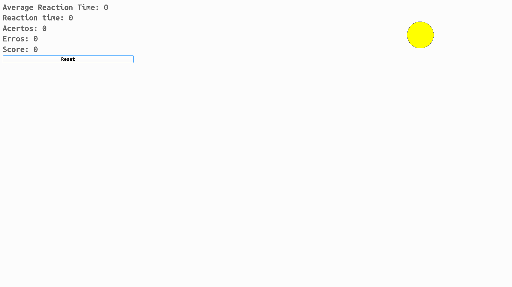

# Reaction Time Game

Developed with Qt Creator, the goal of this game is to press the key corresponding to the color of the circle as fast as possible. The circle colors correspond to the arrow keys: yellow for up, green for down, blue for left, and red for right. When the player presses the key corresponding to the circle color, a new circle is generated at a random position in the window with a randomly chosen color. The number of hits, misses, and reaction time are recorded and displayed on the user interface. Additionally, the game can be reset by clicking on the "Reset" button.

---



## Requirements
Before running the game, make sure you have the following installed on your system:

- Qt 5 or higher
- C++ compiler compatible with C++11

## How to Run
To play the game, follow these steps:

1. Clone this repository to your local machine::
```
git clone https://github.com/thaisaraujom/reaction_time_game.git
```
2. Open the project in Qt Creator:
- Open Qt Creator
- Click on "Open Project" and select the time_reac.pro file from the cloned directory.
3. Build the project:
- In the Qt Creator toolbar, click on "Build" and select "Build Project".
- Wait until the project is successfully built.
4. Run the game:
- Click on "Run" in the Qt Creator toolbar or press "Ctrl + R" to run the game.
- The game will open in a full-screen window.

## Authors
- [Morsinaldo de Azevedo Medeiros](https://github.com/Morsinaldo)
- [Thaís de Araújo de Medeiros](https://github.com/thaisaraujom)

## License
This project is licensed under the MIT License - see the LICENSE.md file for details.

## Qt Creator documentation
The official Qt Creator documentation can be found at https://doc.qt.io/qtcreator/.
